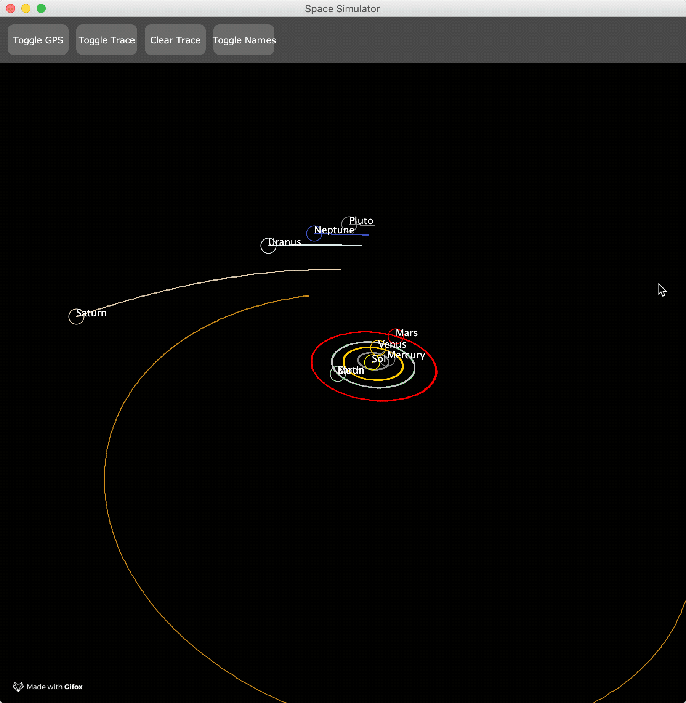
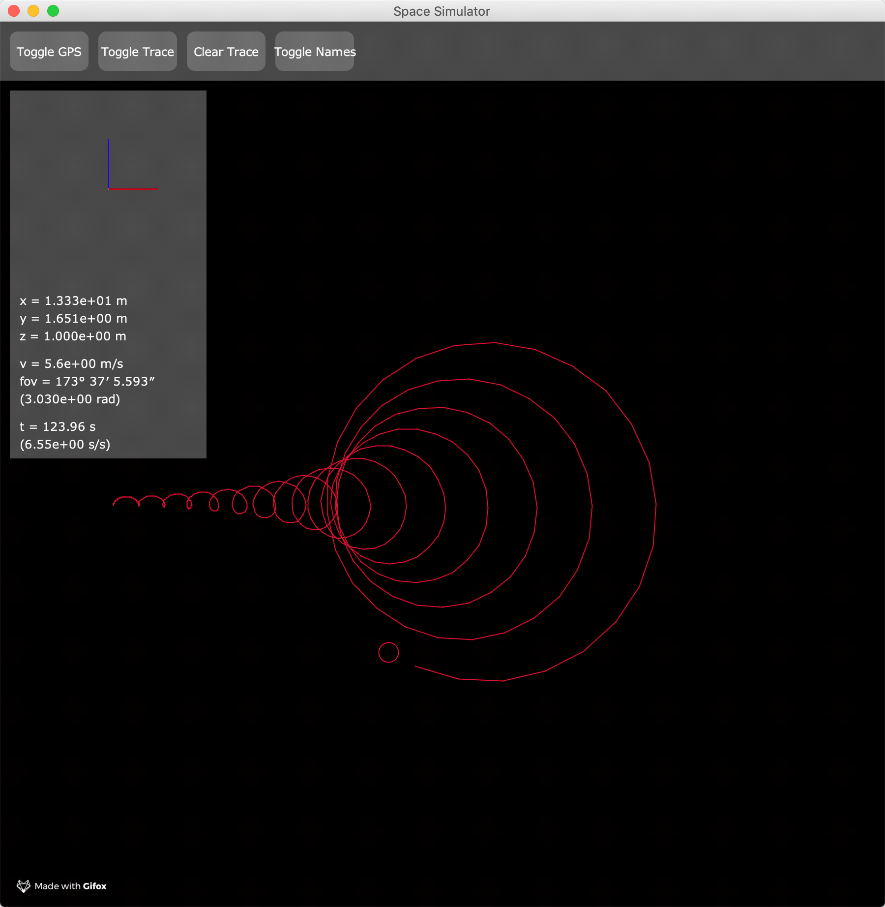

# physim
by James McClung

## Solar System
The natural first system I ever simulated to scale, and one of the simplest, the solar system only requires Newtonian gravity to simulate at this level of detail.

Nevertheless, I enjoy watching the orbits trace themselves out—but I can't speed up time too much, or Mercury gets lost in the progress.

Here is a test of my perspective projection: viewing the solar eclipse from Earth. For obvious reasons, this cannot be done with an orthographic projection without setting the sizes of the sun and moon to be equal. Which is cheating. I don't cheat.

## Particle Cycloid
When a charged particle is placed in orthogonal electric and magnetic fields, it follows a path called a cardioid. This is also the shape traced by a single point on a rolling wheel, and it has several interesting properties.

The small loops you see at what should be tips in the trace are a consequence of calculating forces at discrete time intervals. Using a larger time step exacerbates the issue, but a new pattern emerges.

## The Slit Experiments
The single- and double-slit experiments were revolutionary demonstrations of the wavelike nature of particles at the quantum level. Like a true physicist, I simplify the experiments by approximate waves as masses on springs.

### Single slit:

### Double slit:

Although the particles look the same, there is a "wall" of fixed particles about halfway between the front and back ends. If you look closely, you can even see the slit.

Admittedly, my results do not match reality. This may be due to how I "measure" the waves, or perhaps wave dynamics are more complex than a small array of connected springs.
